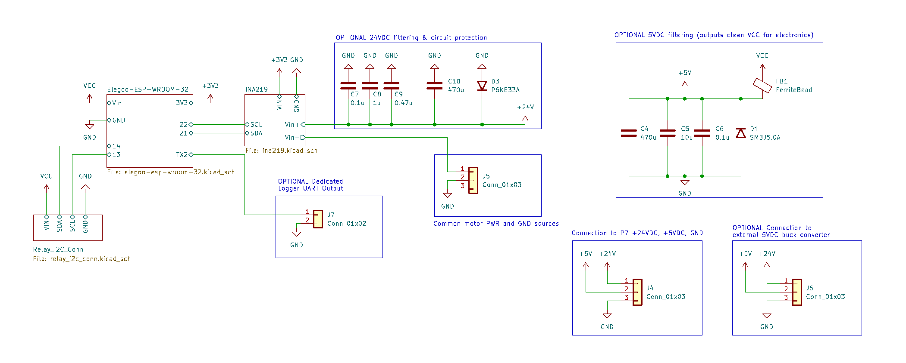
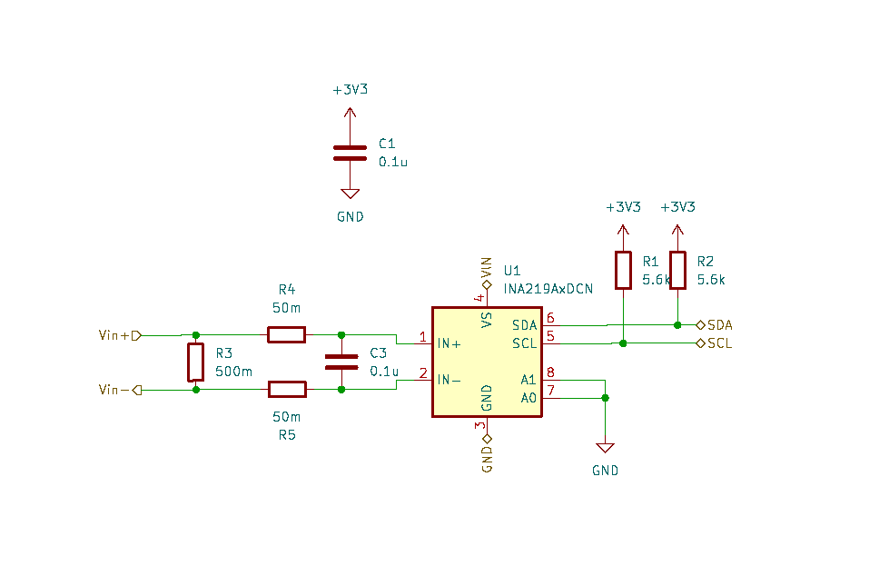

# Hardware Documentation

## Main Schematic

## INA219 Subcircuit Schematic

## Main Bill of Materials (BOM)

| Item | Purpose | Link | Quantity | Notes |
|------|---------|------|----------|-------|
| Elegoo ESP-WROOM-32 DevKit (ESP32) | Microcontroller | [Amazon](https://a.co/d/5vAKYio) | 1 | Any ESP-WROOM-32 DevKit will work |
| INA219 I2C Current Sensor | Current sensor | [Amazon](https://a.co/d/gYvCdcv) | 1 | For custom PCB: INA219AIDCNR ([DigiKey](https://www.digikey.com/en/products/detail/texas-instruments/INA219AIDCNR/1952540)) |
| 16 Channel Expandable Relay Module, 5V Power Supply, IIC Communication | I2C relay board | [Amazon](https://a.co/d/cCdZwwg) | 1 | Min. relays needed = # trays + max # spirals per tray |
| 24VDC Power Supply | Supplying motor power |  | 1 |  |
| 5VDC Power Supply | Supplying MCU, sensor, relay power |  | 1 | Alternatives: 1. Mobile phone charger powering ESP32 DevKit via USB, 2. 24VDC to 5VDC buck converter |
| 470Ω, 1W Resistor | Switch state resistor | [DigiKey](https://www.digikey.com/en/products/detail/te-connectivity-passive-product/ROX1SJ470R/2381467) |  | Purchase quantity to match number of motors in vending machine |

## Optional Components BOM

| Item | Purpose | Link | Quantity | Notes |
|------|---------|------|----------|-------|
| 0.1u MLCC | 24V Supply Decoupling |  | 1 |  |
| 1u MLCC | 24V Supply Decoupling |  | 1 |  |
| 0.47u Film Cap | 24V Supply Decoupling |  | 1 |  |
| 470u Electrolytic Cap | 24V Supply Decoupling |  | 1 |  |
| P6KE33A TVS Diode | 24V Supply Decoupling |  | 1 |  |
| 0.1u MLCC | 5V Supply Decoupling |  | 1 |  |
| 10u MLCC | 5V Supply Decoupling |  | 1 |  |
| 470u Electrolytic Cap | 5V Supply Decoupling |  | 1 |  |
| SMBJ5.0A TVS Diode | 5V Supply Decoupling |  | 1 |  |
| 90mΩ, 600Ω@100MHz Ferrite Bead | 5V Supply Decoupling |  | 1 |  |
| 0.1u MLCC | INA219 Subcircuit |  | 2 |  |
| 500m Resistor | INA219 Subcircuit |  | 1 |  |
| 50m Resistor | INA219 Subcircuit |  | 2 |  |
| 5.6k Resistor | INA219 Subcircuit |  | 2 |  |

## ESP32 Pin Mapping

| ESP32 Pin | Function | Connected to |
|-----------|---------|--------------|
| VIN | VCC input | 5V supply |
| GND | GND reference | Common GND |
| 13 | I2C Bus 2 (Relay) SCL | Relay SCL |
| 14 | I2C Bus 2 (Relay) SDA | Relay SDA |
| 21 | I2C Bus 1 (INA219) SDA | INA219 SDA |
| 22 | I2C Bus 1 (INA219) SCL | INA219 SCL |
| TX2 (17) | Logger UART Output | J7 Pin Header |
| 3V3 | 3V3 Output | INA219 VIN |
